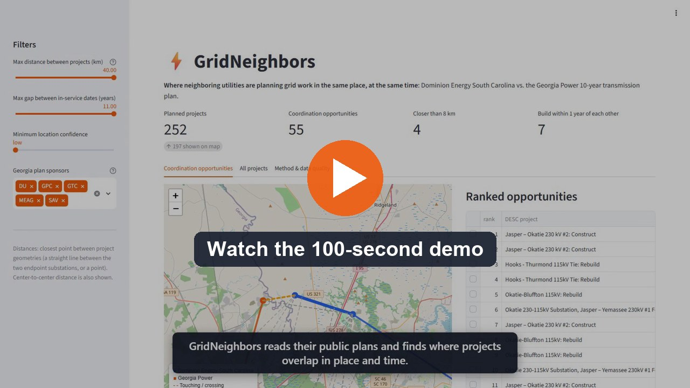
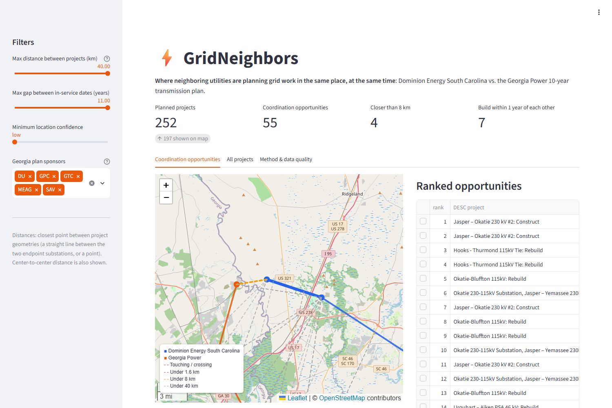
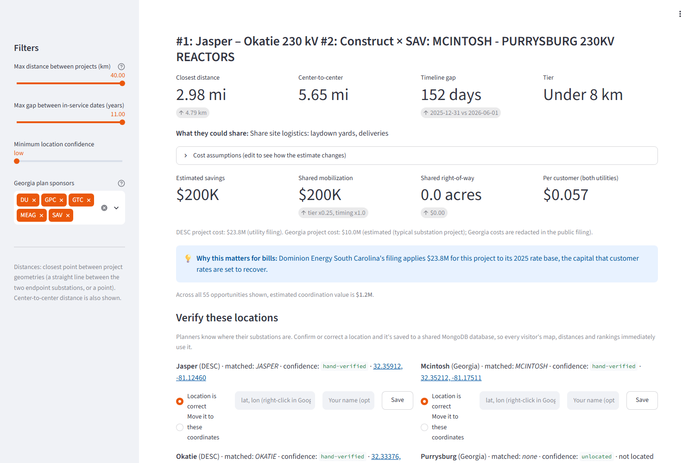
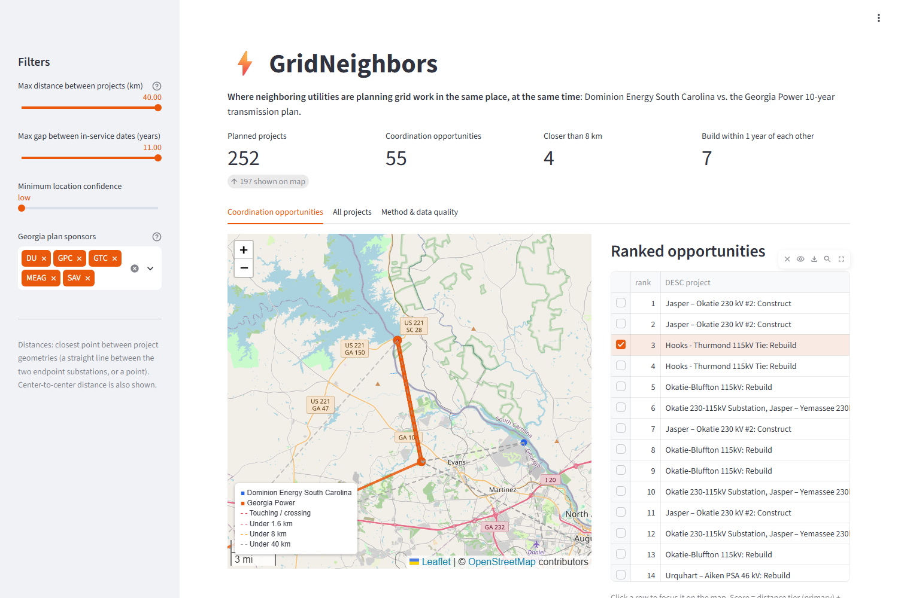
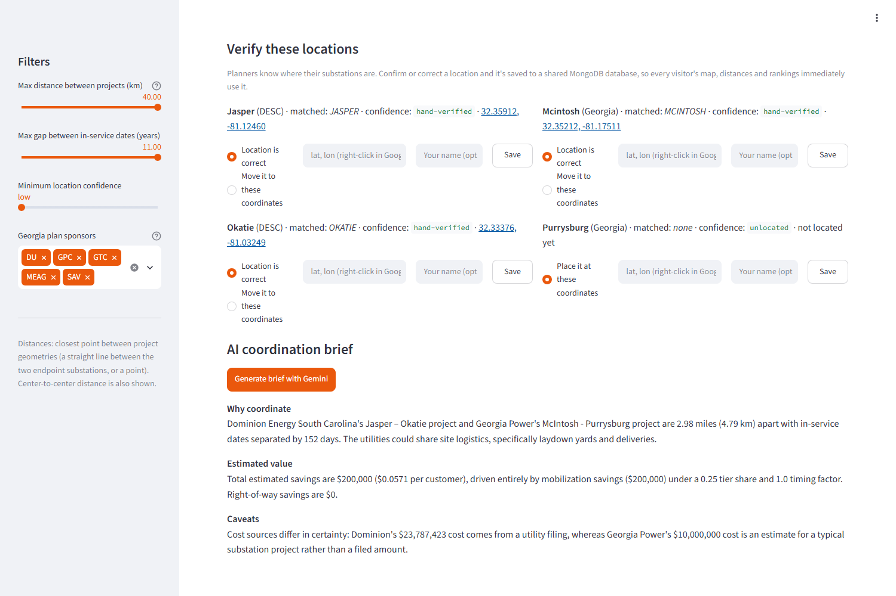

# ⚡ GridNeighbors

**Find where neighboring power utilities are planning grid construction in the same place, at the same time, and what coordinating could save customers.**


Built solo in 24 hours at **[ShellHacks 2026](https://shellhacks-2026.devpost.com/)** (FIU), my first hackathon, for the **Sperry Tech GridLock Challenge**.
**[Devpost submission](https://devpost.com/software/grid-neighbors)** · **[Demo video](https://youtu.be/GqLUE-0TcjY)**

[](https://youtu.be/GqLUE-0TcjY)

> **About the live demo:** during the event the app ran at `gridneighbors.design` on DigitalOcean App Platform, with MongoDB Atlas for shared data. That hosted version was shut down after judging. You can still [run it locally](#run-it-locally) in about two minutes; the processed data is included in the repo.



---

## The problem

Utilities plan transmission construction (new lines, rebuilt lines, substation upgrades) years in advance, but **neighboring utilities plan separately**, often across state lines. Two crews can end up rebuilding lines a few miles and a few months apart, each paying to mobilize its own crews, equipment, laydown yards and right-of-way. Those costs go into each utility's **rate base**, which customers pay back through their electric bills.

FERC issued [Order No. 1920](https://www.ferc.gov/explainer-transmission-planning-and-cost-allocation-final-rule) in 2024 because siloed, piecemeal planning makes consumers pay more than necessary. GridNeighbors makes coordination opportunities visible at the level of individual projects.

## What it does

GridNeighbors compares **Dominion Energy South Carolina (DESC)** with **Georgia's 10-Year Transmission Plan** (Georgia Power and its planning partners), neighbors across the Savannah River.

- **Parses the utilities' own public filings:** 252 planned projects (44 DESC, 208 Georgia) with in-service dates, plus cost and rate-base year for DESC
- **Maps every project** by matching its endpoint substations to OpenStreetMap, with a confidence grade for each location
- **Finds 55 cross-utility overlaps** within 40 km (25 mi), measured between the projects' **closest points**, and groups them into coordination tiers:

  | Tier | What the utilities could share |
  |---|---|
  | Touching / crossing | Must coordinate: outage timing, crossing structures |
  | Under 1.6 km | Right-of-way, access roads, permits |
  | Under 8 km | Laydown yards, deliveries |
  | Under 40 km | Crews and equipment |

- **Ranks the opportunities**, with distance as the main signal and timeline overlap as the second
- **Estimates the value of coordinating** (shared mobilization and shared land) with editable assumptions, down to the savings per customer
- **Explains each opportunity with Gemini:** a short planner-ready brief built only from numbers the code computed
- **Gets more accurate with use:** anyone can confirm, correct or place a substation location. Verifications are stored in **MongoDB Atlas** and update everyone's map and rankings.

### Key findings

| | |
|---|---|
| **#1 opportunity** | DESC's new *Jasper–Okatie 230 kV #2* line and Georgia Power's *McIntosh–Purrysburg 230 kV* project near Savannah: **2.98 mi apart, finishing 152 days apart**. DESC's filing puts **$23.8M** of the project into its 2025 rate base. |
| **Must-coordinate pair** | DESC's *Hooks–Thurmond* tie and Georgia Power's *Evans Primary–Thurmond Dam* rebuilds **end at the same substation**. |
| **Across all 55 pairs** | About **$1.2M** in estimated coordination value (see [assumptions](#how-the-numbers-are-calculated)) |

<table>
<tr>
<td></td>
<td></td>
</tr>
<tr>
<td align="center"><em>Opportunity detail and cost estimate</em></td>
<td align="center"><em>Both utilities building into Thurmond Dam</em></td>
</tr>
</table>

## How it works

```
 DATA PIPELINE (offline, results committed as CSV)
 ─────────────────────────────────────────────────
  DESC project PDF ─┐
                    ├─► ingest.py ─► geocode.py ─────────► projects.csv
  Georgia IRP PDF ──┘   (parse)      (OSM match, border
                                      checks, confidence)

 LIVE APP (Streamlit)
 ────────────────────
  projects.csv + MongoDB verifications ─► overlap.py ─► ranked opportunities
                                                              │
                   map + table  ◄─────────────────────────────┤
                   cost.py estimate ◄─────────────────────────┤
                   Gemini brief (explains computed facts) ◄───┘
```

| Step | Module | What it does |
|---|---|---|
| Parse | [`gridlock/ingest.py`](gridlock/ingest.py) | `pdfplumber` reads DESC's one-project-per-page list; `pypdf` reads the 10-year project table (pp. 177–190) of Georgia Power's 668-page IRP volume |
| Locate | [`gridlock/geocode.py`](gridlock/geocode.py) | Extracts endpoint names ("SAV: GOSHEN (SAV) - MCINTOSH 115KV…" → Goshen, McIntosh), matches them to OSM substations (exact, then fuzzy), falls back to Nominatim, and rejects same-named substations in the wrong state using a Savannah River / NC / FL border model |
| Overlap | [`gridlock/overlap.py`](gridlock/overlap.py) | Closest-point distance between project geometries in an equal-area projection (EPSG:5070), tiers, timeline gap, score |
| Cost | [`gridlock/cost.py`](gridlock/cost.py) | Shared mobilization and right-of-way savings, per-customer impact, rate-base context |
| Explain | [`gridlock/brief.py`](gridlock/brief.py) | Gemini brief grounded in computed facts, with fallback across models and cached results |
| Verify | [`gridlock/store.py`](gridlock/store.py) | Community location verifications in MongoDB Atlas, layered on top of the automated matches |
| App | [`app.py`](app.py) | Streamlit + Folium: linked map, ranked table, detail panel, filters |



## How the numbers are calculated

**Score (0–100):** distance is the primary signal, timing the secondary one, discounted for uncertain locations:

$$\text{score} = w\left[45\left(1-\frac{d}{40\ \text{km}}\right) + \tfrac{1}{2}P + 35\max\left(0,\ 1-\frac{\Delta t}{1095\ \text{days}}\right)\right]$$

- **d** is the closest distance between the two projects.
- **P** is the tier bonus: 40, 30, 15 or 0 points.
- **Δt** is the gap between in-service dates.
- **w** is the location-confidence weight: 1.0 for high or verified, 0.9 for medium, 0.7 for low.

**Savings:**
- **Shared mobilization** = smaller project's cost × 8% × tier share (0.5 / 0.4 / 0.25 / 0.1) × timing factor.
  - The timing factor is 1.0 if the finish dates are within 6 months, 0.7 within 1 year, 0.4 within 2 years, and 0.1 beyond that.
- **Shared right-of-way** applies only to pairs within 1.6 km: parallel length × ROW width (30 / 38 / 61 m by voltage) × easement cost per acre.

**Redacted costs:** Georgia's public filing redacts all dollar amounts, so the app estimates them and labels them as estimates:
- **$1.5M per mile** for line projects, editable in the app.
- **$10M** for single-site projects such as substations.

Using the *smaller* project's cost means these estimates can't inflate the savings. For comparison, DESC's own filed lines cost about $2–2.2M per mile.

## Validation

`pytest` runs **19 tests**, including checks that reproduce **all 6 overlaps in Sperry's answer key** (center-to-center distances within 0.3 mi), plus the parser, the state-border model, tiers, and verification logic.

**Location confidence:** 197 of 252 projects are placed on the map.

| Grade | Meaning |
|---|---|
| high | Exact substation match, and the operator matches the utility |
| medium | Exact name match, but no operator listed |
| low | Fuzzy or place-name match |
| verified | Confirmed or corrected by a user |

The 55 projects without a location are mostly in the Atlanta area, far from the border.

## The hackathon

| | |
|---|---|
| **Event** | ShellHacks 2026, Florida's largest hackathon (10th anniversary), Florida International University, Sept 26–27, 2026 |
| **Team** | Solo, first-time hacker |
| **Challenge** | Sperry Tech GridLock: compare at least two utilities' public construction plans, flag geographic (< 40 km) and timeline overlaps, show them on an interactive map with a ranked list, and estimate the impact (bonus) |
| **Tracks entered** | Sperry Tech GridLock · Microsoft "What's Missing?" · MLH Best Use of Gemini API · MLH Best Use of MongoDB Atlas · MLH Best Use of DigitalOcean · MLH Best Domain Name from GoDaddy Registry · Best First-Time Hacker |
| **Deployed during the event** | DigitalOcean App Platform (auto-deploy from this repo via `Procfile`), MongoDB Atlas, custom domain `gridneighbors.design` |

## Run it locally

```bash
python -m venv .venv
.venv/Scripts/pip install -r requirements.txt   # macOS/Linux: .venv/bin/pip
.venv/Scripts/streamlit run app.py
```

Optional features: copy `.env.example` to `.env` and fill in:

| Variable | Enables |
|---|---|
| `GEMINI_API_KEY` | Gemini coordination briefs ([Google AI Studio](https://aistudio.google.com/apikey)) |
| `GEMINI_MODEL` | Preferred Gemini model (default `gemini-3.8-flash`) |
| `MONGODB_URI` | Shared location verifications (MongoDB Atlas connection string) |

The app runs without either one; those features are simply hidden.

### Project structure

```
app.py                  Streamlit app (map, ranked table, detail panel, verification, briefs)
gridlock/
  ingest.py             Parse the two utilities' PDF project lists
  geocode.py            Match endpoint substations to OpenStreetMap; border model; confidence
  overlap.py            Closest-point overlaps, tiers, timeline gap, score
  cost.py               Savings and per-customer impact estimate
  brief.py              Gemini coordination briefs (with model fallback and cache)
  store.py              MongoDB Atlas location verifications
  pregen_briefs.py      Pre-generate briefs for the top opportunities
data/
  processed/            projects_raw.csv, projects.csv, overlaps.csv
  overrides.csv         Hand-verified substation coordinates
  briefs.json           Cached Gemini briefs
tests/                  pytest suite (includes Sperry's answer key)
tools/capture_media.py  Headless-browser capture of the screenshots and demo video
docs/images/            README images
```

### Rebuilding the data

The processed CSVs are committed, so this is only needed to regenerate them. It requires the sponsor's `Sperry-Tech-Challenge/` folder, which is not committed, and an OpenStreetMap substation export saved to `data/cache/osm_substations.json`. That export comes from this [Overpass](https://overpass-turbo.eu/) query:

```
[out:json][timeout:180];
( nwr["power"="substation"](30.3,-85.7,35.3,-78.4);
  nwr["power"="plant"](30.3,-85.7,35.3,-78.4); );
out center tags;
```

```bash
.venv/Scripts/python -m gridlock.ingest     # PDFs -> data/processed/projects_raw.csv
.venv/Scripts/python -m gridlock.geocode    # -> data/processed/projects.csv (Nominatim fallback is cached)
.venv/Scripts/python -m gridlock.overlap    # -> data/processed/overlaps.csv
.venv/Scripts/python -m pytest
```

To hand-verify coordinates, add them to [`data/overrides.csv`](data/overrides.csv). They're zone-aware, since Georgia has two "Goshen" substations.

## Limitations and what's next

- **Straight lines:** utilities publish endpoint substations, not routes, so lines are drawn straight between them. Next: use real OSM transmission-line routes.
- **Open editing:** anyone can submit a location verification (every edit is logged with the previous location). Next: sign-in for utility and regulator staff, and a review step.
- **Two utilities:** the pipeline doesn't depend on a particular utility, so the next step is adding more neighbors (Duke, Santee Cooper).
- **Customer view:** a ZIP-code view showing the grid projects near you and how they reach your electric bill.

## Built with

Python · pandas · pdfplumber · pypdf · Shapely · pyproj · OpenStreetMap (Overpass, Nominatim) · Streamlit · Folium · Google Gemini API · MongoDB Atlas · pytest · Playwright. Hosted during the event on DigitalOcean App Platform with a GoDaddy Registry (`.design`) domain.

## Acknowledgments

Built by **Jonathan Guerrero** at [ShellHacks 2026](https://shellhacks-2026.devpost.com/) (FIU), my first hackathon. Thanks to **Sperry Tech** for the GridLock challenge and its data package, and to the ShellHacks organizers and MLH. Developed with AI coding assistance (Claude Code).

Data: Dominion Energy South Carolina *Planned Transmission Projects $2M and above* (SCRTP) and the *Georgia ITS 10-Year Plan* in Georgia Power's 2025 IRP Vol. 3, public disclosure version. Only public filings are used. Map data © OpenStreetMap contributors.
